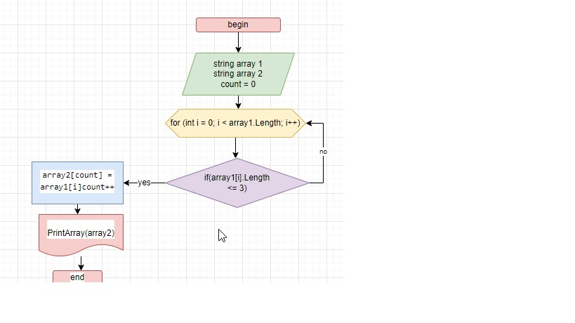

*Программа, решающая поставленную задачу*
1.	Объявили 2 массива: изначальный и второй такой же длины.
2.	 Метод, в котором цикл, соразмерный длине массива, внутри цикла проверка условия ( <=3 ), если да - элемент первого массива заносится в count элемент второго массива. Переменная count - для поочередного помещения из первого массива во второй (без пробелов).
3.	 После присвоения увеличивается переменная count на 1 и возвращается к циклу for в котором i увеличивается на 1. 

